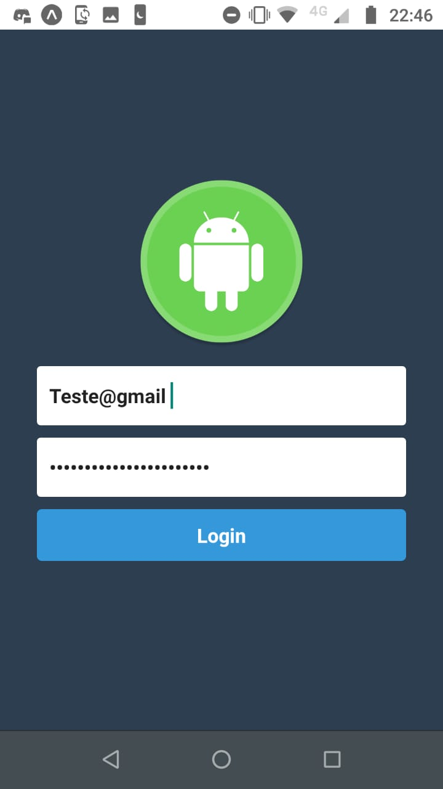
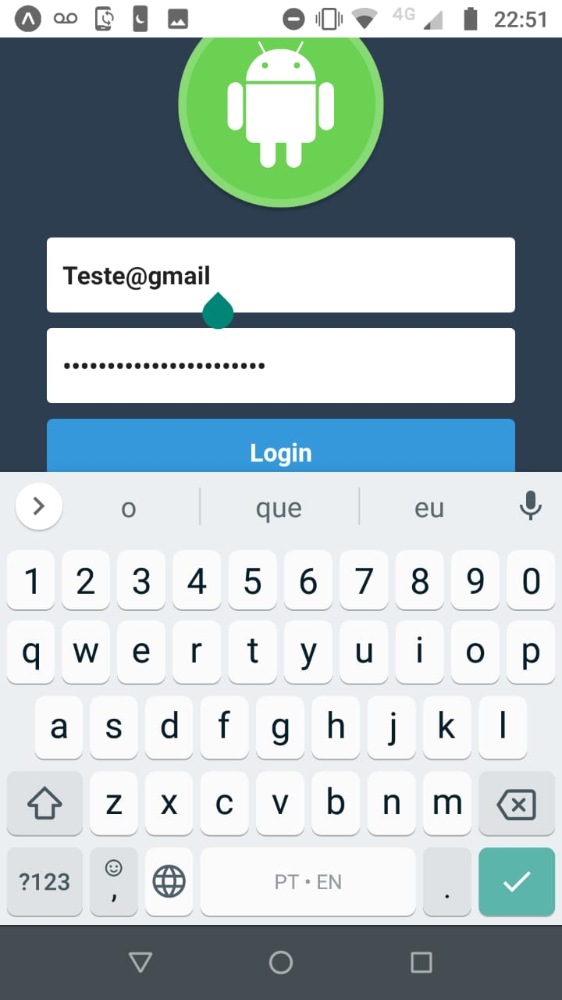

# login-react-native
 Login  using expo  and  react-native


<p>
  
    
</p>


## Tópicos 

[Tecnologias](#tecnologias)

[Instalação e uso](#instalação-e-uso)

[Licença](#licença)

<br>

## Sobre o APP

O projeto feito  faz  parte  do  meu estudo  na Escola  técnica de são Paulo [ETEC](https://www.cps.sp.gov.br/category/etec/).

<br>

<p align="center">
  
  
</p>

## Tecnologias

As seguintes tecnologias foram utilizadas no desenvolvimento do projeto:

- [JavaScript](https://www.javascript.com/)
- [React](https://reactjs.org/)
- [React Native](https://reactnative.dev/)
- [Expo](https://expo.io/)
- [Node](https://nodejs.org/en/)

<br>

## Instalação e uso


```bash
# Abra um terminal e copie este repositório com o comando
$ git clone https://github.com/felipegfsouza/login-react-native
# ou use a opção de download.

# Entre na pasta server 
$ cd login-react-native

# Instale as dependências
$ expo install

# Rode o servidor
$ expo start
```

<br>


### Mobile (App)

```bash
# Entre na pasta mobile com 
$ cd login-app

# Instale as dependências
$ expo install

# Rode o app
$ expo start

# Escaneie o QR Code exibido na janela do navegador.
```

<br>

## Licença
<a href="https://opensource.org/licenses/MIT">
    
</a>

<br>

Esse projeto está sob a licença MIT. Veja o arquivo [LICENSE](/LICENSE) para mais detalhes.

---

Feito com amor by [Felipe Souza ](https://github.com/felipegfsouza)
